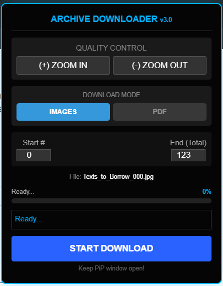

# Archive.org Borrowed Book Downloader

This script is designed to download borrowed books from Archive.org by automatically flipping pages and capturing images. It includes a built-in UI for quality control and progress tracking.

> [!IMPORTANT]
> This tool is intended for use with **borrowed books** on Archive.org.

## Features

- **Quality Control:** Use **Zoom In (+)** to increase image quality or **Zoom Out (-)** to decrease it before starting.
- **PiP Mode:** A Picture-in-Picture window opens automatically to keep the script active in the background and show progress (Current Page / Total).
- **Automation:** Captures each page individually and saves it as a `.jpg` file.
- **Smart Naming:** Automatically cleans the book title and uses it for file naming (`BookTitle_001.jpg`).

## Visuals

  
  

## How to Use

You can use this tool in two ways:

### 1. Console Method
1. Open the book you want to download on Archive.org.
2. Open your browser's **Developer Tools** (Press `F12` or `Ctrl+Shift+I`).
3. Go to the **Console** tab.
4. Copy the entire code from [Archive Downloader.txt](Archive%20Downloader.txt), paste it into the console, and press `Enter`.
5. Use the control panel that appears on the top right.

### 2. Bookmarklet Method (Recommended)
1. Create a new bookmark in your browser.
2. Name it "Archive Downloader".
3. Copy the code from [Archive Downloader Bookmark.txt](Archive%20Downloader%20Bookmark.txt) and paste it into the **URL** field of the bookmark.
4. While on the Archive.org book page, simply click the bookmark to launch the tool.

## Technical Details

- Uses a **PiP (Picture-in-Picture) hack** to prevent the browser from throttling the script when the tab is in the background.
- Monitors page count automatically from the Archive.org interface.
- Includes a 15-second timeout for slow-loading pages to prevent skipping.

## License

This project is licensed under the [MIT License](LICENSE).
