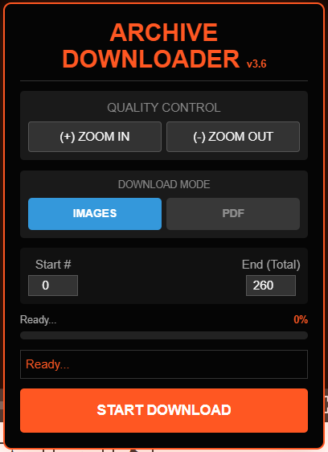

<div align="center">
  
# 📚 Archive.org Borrowed Book Downloader

### 🚀 Download any borrowed book from Archive.org as PDF or Images — for free!

<br/>

[](https://github.com/AllLiveSupport/Archive-Downloader/stargazers)
[](LICENSE)
[](archive-downloader.user.js)
[](https://buymeacoffee.com/alllivesupport)

<br/>


---

**✨ PDF Export • 🖼️ Image Mode • 📊 Progress Tracking • 🎬 PiP Support**

> [!WARNING]
> This tool works **ONLY with borrowed books**. You must have an active loan on Archive.org to use this downloader.

</div>

<br/>

---

## 🎯 Methods Comparison

| Method | Best For | Difficulty | Latest Version |
|:-------|:---------|:-----------|:---------------|
| 🌐 **Tampermonkey** | Quick & easy (Recommended) | ⭐ Easy | **v3.6** (Orange) |
| 💻 **Console** | Developers, manual use | ⭐⭐ Medium | **v3.0** (Blue) |
| 🔖 **Bookmarklet** | Quick use (Restricted) | ⭐⭐⭐ Hard | Legacy |

---

<br/>

## 🌐 Method 1: Tampermonkey (Recommended)

### Step 1: Install Tampermonkey Extension

| Browser | Install Link |
|:-------:|:------------:|
|  | [Install](https://chrome.google.com/webstore/detail/tampermonkey/dhdgffkkebhmkfjojejmpbldmpobfkfo) |
|  | [Install](https://addons.mozilla.org/en-US/firefox/addon/tampermonkey/) |
|  | [Install](https://microsoftedge.microsoft.com/addons/detail/tampermonkey/iikmkjmpaadaobahmlepeloendndfphd) |

### Step 2: Install the Script

1. Open [**`archive-downloader.user.js`**](archive-downloader.user.js).
2. Click the **"Raw"** button or copy the entire code.
3. In Tampermonkey, click **"Create a new script"**, paste the code, and **Save (Ctrl+S)**.

### Step 3: Use It!

1. 📖 **Borrow a book** from Archive.org.
2. 👁️ Open the book in the reader.
3. 🟠 Click the **orange download button** in the bottom-right.
4. ⚙️ Adjust quality with **ZOOM IN** (Optional).
5. 🚀 Set range and click **START DOWNLOAD**.

<br/>

---

## 📸 Screenshots

| Feature | Screenshot |
|:---|:---|
| **Launcher Button** |  |
| **Control Panel** |  |
| **Background Progress** |  |

<br/>

---

## ✨ Key Features

- 📄 **Native PDF Export**: Built-in engine creates PDFs without extra libraries.
- 🖼️ **Image Export**: Saves every page as a high-quality JPEG.
- 🏁 **Smart Ending**: Automatically detects the last page of the book.
- 🔍 **Quality Boost**: Built-in zoom controls to capture higher resolution images.
- 🎬 **PiP Survival**: Keeps the download running even if the tab is in the background.
- 📊 **Visual Feedback**: Real-time progress bar with percentage tracking.

<br/>

---

## 📂 Project Structure

```bash
📦 Archive-Downloader
 ┣ 📂 docs/images
 ┃ ┣ 🖼️ TDownload Button.PNG
 ┃ ┣ 🖼️ TDownloader.PNG
 ┃ ┗ 🖼️ PIP.PNG
 ┣ 📜 archive-downloader.user.js          # Latest Tampermonkey script (v3.6)
 ┣ 📜 Archive Downloader.txt              # Console script (v3.0)
 ┣ 📜 Archive Downloader Bookmark.txt     # Bookmarklet script
 ┗ 📜 LICENSE
```

<br/>

---

## ❓ FAQ

<details>
<summary><b>Is Tampermonkey free?</b></summary>
Yes! It is completely free and open source.
</details>

<details>
<summary><b>Why is the button orange?</b></summary>
The orange theme indicates version 3.6, which includes the latest security bypasses and quality improvements.
</details>

<details>
<summary><b>The button doesn't appear. Why?</b></summary>
Ensure the book is <b>borrowed</b> (active loan), the script is installed and enabled, and you have refreshed the page.
</details>

<br/>

---

## ⚠️ Disclaimer

> [!CAUTION]
> **Legal Notice:** This tool is provided for **personal and educational purposes only**.

- 📚 **Respect Copyright:** Only use this for your personal backup of borrowed materials.
- ⚖️ **Terms of Service:** You are responsible for complying with Archive.org's TOS.
- 👤 **Ownership:** Do not redistribute downloaded files.

<br/>

---

<div align="center">

### ⭐ Star this repo if it helped you!

<br/>

[](https://github.com/AllLiveSupport)

</div>
